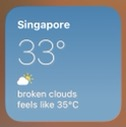
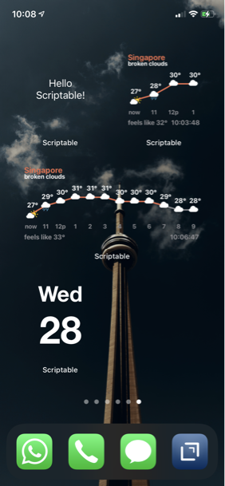
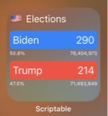

# [Scriptable.app](https://scriptable.app) scripts

## Scripts
* [Import-Script.js](Import-Script/Import-Script.js) - a script to download and import other scripts into your Scriptable library. [Read more](Import-Script).  
After you downloaded Import-Script, tap on the **Import** links below to import them into your library.

* [OAuth2](OAuth2) - see [Automators.fm topic](https://talk.automators.fm/t/building-a-general-purpose-oauth-redirect-proxy-for-shortcuts-and-scriptable/4420).

## Utilites
---
* [no-background](http://github.com/supermamon/scriptable-no-background) - a module to simulate transparent background for widgets.
* [openweathermap](openweathermap) - A module to encapsulate OpenWeatherMap's [One Call API](https://openweathermap.org/api/one-call-api) and more
* [basic-ui](utilities/basic-ui.js) - a helper moduel for user interactions
* [json-utils](utilities/json-utils.js) - a helper module for reading, storing, and converint JSON.

## Widgets

* [xkcd-widget](#xkcd-widget)
* [Peanuts™ Widget](#peanuts-widget)
* [Instagram Latest Posts](#instagram-latest-posts)
* [Simple Weather Widget](#simple-weather-widget)
* [Transparent Widgets](#transparent-widgets)
* [US Elections Widget](#us-elections-widget)
* [RoutineHub Profile Widget](#routinehub-profile-widget)

---
### xkcd Widget
A widget to show current/random xkcd comic.

[Source](xkcd-widget/xkcd.js) | [Import](https://open.scriptable.app/run/Import-Script?url=https://github.com/supermamon/scriptable-scripts/xkcd-widget/xkcd.js) 

--- 
### Peanuts Widget
A widget to show current/random Peanuts™ comic.

[Source](peanuts-widget/peanuts-widget.js) | [Import](https://open.scriptable.app/run/Import-Script?url=https://github.com/supermamon/scriptable-scripts/peanuts-widget/peanuts-widget.js)

---
### Instagram Latest Posts
Randomly show between the 12 of the most recent post from a user or users.

[Source](https://github.com/supermamon/scriptable-instagram-widgets/blob/master/ig-latest-post.js) | [Import](https://open.scriptable.app/run/Import-Script?url=https://github.com/supermamon/scriptable-instagram-widgets/ig-latest-post.js)

---
### Simple Weather Widget

Example widget that uses the [openweathermap](openweathermap) module. [Read more](openweathermap).

[Source](openweathermap/simple-weather-widget.js) | [Import](https://open.scriptable.app/run/Import-Script?url=https://github.com/supermamon/scriptable-scripts/openweathermap/simple-weather-widget.js)

---
### Transparent Widgets
Examples of `no-background` can been seen at the [no-background repository](https://github.com/supermamon/scriptable-no-background).

---
### US Elections Widget
Show the latest electoral votes for all candidates.

[Source](misc/us-elections.js) | [Import](https://open.scriptable.app/run/Import-Script?url=https://github.com/supermamon/scriptable-scripts/misc/us-elections.js)

---
### RoutineHub Profile Widget
A widget to show the current shortcuts and download counts of a [routinehub.co](https://routinehub.co) profile. 

[Source](routinehub-widgets/rh-profile-widget.js) | [Import](https://open.scriptable.app/run/Import-Script?url=https://github.com/supermamon/scriptable-scripts/routinehub-widgets/rh-profile-widget.js) 

