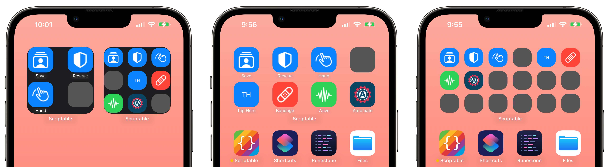

# ButtonsWidget



A customizable launcher widget.

[Source](../source/buttons-widget.js) | [Import](https://open.scriptable.app/run/Import-Script?url=https://github.com/supermamon/scriptable-scripts/source/buttons-widget.js)

---

* [Syntax](#syntax)
* [Options](#options)
* [Grid Sizes](#grid-sizes)
* [Button](#button)
* [Examples](#examples)
* [FAQ](#faq)

---


## Syntax

```js
const { ButtonsWidget } = importModule('buttons-widget')
const buttons = [...]
const widget = new ButtonsWidget(buttons, options)
```

| Parameter | Description                                                      |
| --------- | ---------------------------------------------------------------- |
| `buttons` | a JSON array containing a list of [button](#button) definitions. |
| `options` | customization [options](#options).                               |

[[Top]](#buttonswidget)

---


## Options

All options are, well, optional. Defaults defined where needed.

| Option             | Default                       | Compact Default     | Description                                                                                       |
| ------------------ | ----------------------------- | ------------------- | ------------------------------------------------------------------------------------------------- |
| `backgroundImage`  | none                          | none                | Image to use as a background of the widget                                                        |
| `widgetFamily`     | config.widgetFamily           | config.widgetFamily | The size of the widget as defined by the default                                                  |
| `compact`          | false                         | N/A                 | `true` increases button capacity.<sup>1</sup> See [Grid Sizes](#grid-sizes).                      |
| `padding`          | 3                             | 3                   | Space around the whole widget                                                                     |
| `rows`             | See [Grid Sizes](#grid-sizes) |                     | Number of icon rows                                                                               |
| `cols`             | See [Grid Sizes](#grid-sizes) |                     | Number of icon columns                                                                            | 
| `emptyIconColor`   | Color.darkGray()              | Color.darkGray()    | Background color of an empty icon                                                                 |
| `iconWidth`        | _calculated_<sup>2<sup>       | _calculated_        | The width of each icon. Will be also used as height.                                              |
| `iconCornerRadius` | 18                            | 18                  | Corner radius of each icon. Higher = more circular                                                |
| `iconColor`        | Color.blue()                  | Color.blue()        | Default icon color for the whole widget                                                           |
| `iconFontSize`     | 18                            | 10                  | Font size of the initials that appear on the icon when both `symbol` and `icon` are not provided. |
| `iconTintColor`    | Color.white()                 | Color.white()       | The color of the SFSymbols or text on the icon                                                    |
| `labelFont`        | Font.caption2()               | Font.caption2()     | Font of the label that appear under the icon                                                      |
| `labelColor`       | none                          | none                | Color of the label that appear under the icon                                                     |

<sup>1</sup>While it will increase capacity, labels are not shown on `compact` mode.
<sup>2</sup>Math.floor((screenSize.width - (screenSize.width * 0.17)) / 5.5)

[[Top]](#buttonswidget)

---


### Grid Sizes

The number of default icon spaces available depends on the widget size and the value of the `compact` property.
The values on the table below are presented in row x columns.
The grid can be modified by values to the `rows` and `cols` properties.

| Widget Size | Regular | Compact |
| ----------- |:-------:|:-------:|
| Small       |  2 x 2  |  3 x 3  |
| Medium      |  2 x 4  |  3 x 6  |
| Large       |  4 x 4  |  6 x 6  |
| Extra Large |  4 x 8  | 6 x 12  |

[[Top]](#buttonswidget)

---


## Button

The table below lists the properties applicable to buttons. For a button to have a tap target, an `action` needs to be assigned. 
An `action` can be a url to a website or a url-scheme to execute actions in an app - like shortcuts or scripts from Scriptable.

A button can show either an image, and SFSymbol, or a text initials. The initials are automatically derived from the `label` property.
The script will prioritize `icon`, then `symbol`, then `label` - whichever the first one that has value.

| Property    | Description                                                                                     | 
| ----------- | ----------------------------------------------------------------------------------------------- |
| `action`    | Default: _none_. A url to call when a button is tapped. url-schemes allowed                     |
| `label`     | Default: _none_. The text to appear at the bottom of the icon.                                  |
| `symbol`    | Default: _none_. An SFSymbol name to use as an icon for the button.                             |
| `icon`      | Default: _none_. An image to use an as icon for the button.                                     |
| `iconColor` | Default: _blue_. The background color used for the icon. Overrides the main `iconColor` option. |

[[Top]](#buttonswidget)

---

## Examples

Below is a 2x2 icon widget showing different types of buttons.

```js
const { ButtonsWidget } = importModule('buttons-widget')

let buttons = [
  // image icons
  { icon: (await getAutomatorsIcon()), iconColor: new Color('#094563'), label: 'Automate', action: 'https://talk.automators.fm' },

  // SFSymbol icon
  { symbol: 'rectangle.stack.person.crop', action: 'http://www.savethechildren.org/', label: "Save" },

  // SFSymbol icon with custom color
  { symbol: 'bandage', action: 'https://www.directrelief.org/', iconColor: Color.red(), label: 'Bandage' },

  // just label, no icon/symbol
  { label: "Tap Here", action: "http://www.doctorswithoutborders.org/" },
]

const widget = new ButtonsWidget(buttons)
Script.setWidget(widget)

async function getAutomatorsIcon() {
  const req = new Request('https://talk.automators.fm/user_avatar/talk.automators.fm/automatorbot/90/16_2.png')
  return (await req.loadImage())
}
```

**More Examples**

* [buttons-widget-sample.js](../source/buttons-widget-sample.js)

[[Top]](#buttonswidget)

---

## FAQ

**How do I assign a URL-Scheme from an app as an action?**

Simply set the `action` property of a button the the url-scheme. Examples:

* Shortcuts: `{ action="shortcuts://run-shortcut?name=name_of_shortcut", ... }`
* Scriptable: `{ action="scriptable:///run/name_of_script", ... }`
* Apollo: `{ action="apollo://www.reddit.com/r/ApolloApp", ... }`


**How do I make the widget background transparent?**

See [no-background](https://github.com/supermamon/scriptable-no-background).

[[Top]](#buttonswidget)