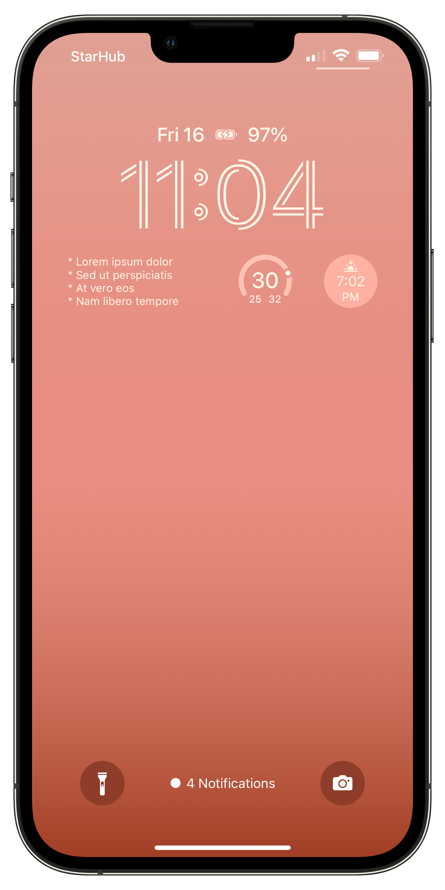
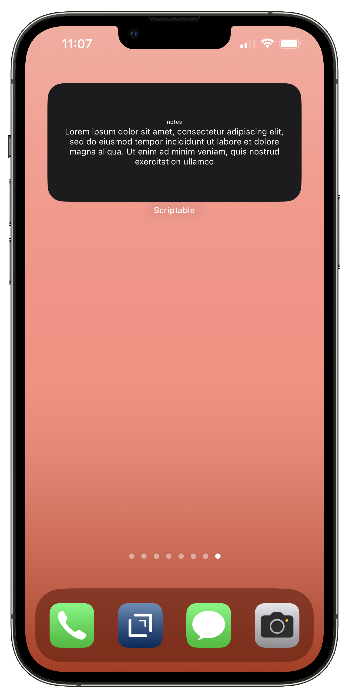
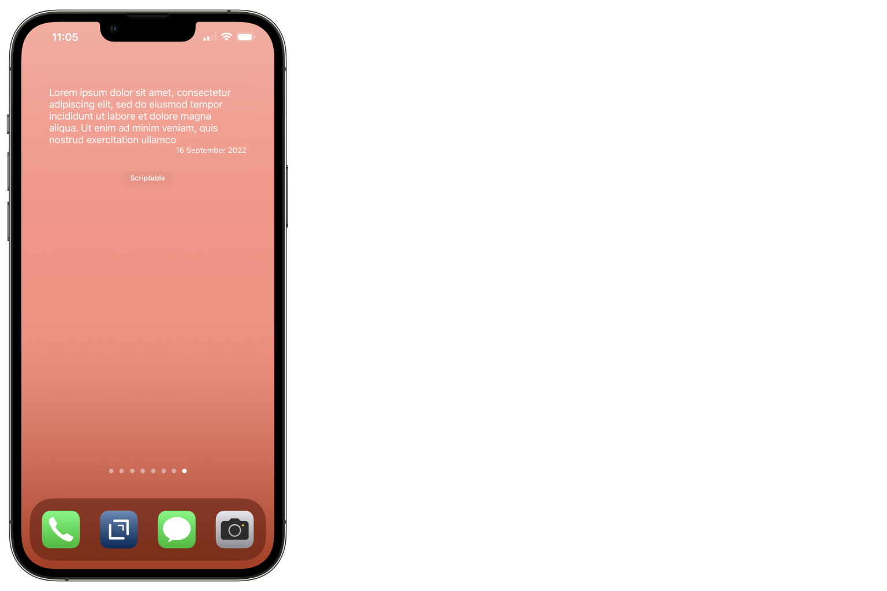

# Text File Widget


Display the contents of a text file on a widget. Works best for short texts but also flexible to allow displaying longer text files. 

This is Scriptable **module** that extends the `ListWidget` class so widget. So styling, additional content may be added if needed.

This can be used as a lock screen or a home screen widget.

[Source](../source/lib-text-file-widget.js) | [Import](https://open.scriptable.app/run/Import-Script?url=https://github.com/supermamon/scriptable-scripts/source/lib-text-file-widget.js)

---

## How to use?

Here's a four-liner to load a file into a widget.

```js
const { TextFileWidget } = importModule('lib-text-file-widget')
const widget = new TextFileWidget('notes/reminders.txt')
await widget.waitForLoad()
Script.setWidget(widget)
```

The rectangular widget below shows how the file will be rendered. 
The two circular widget are other example for the same widget using other files.




## Options

```js
const { TextFileWidget } = importModule('lib-text-file-widget')

const options = {

    // padding
    // default: 10, forced 0 for lock screen widgets
    padding: 8,  

    // text scaling
    // default 0.65
    minimumScale: 0.8,  

    // define where the filename parameter is an 
    // absolute or relative path
    // default: false
    absolute: false,

    // Font of the content
    // default: Font.body()
    font: Font.regularSystemFont(12),

    // display the filename on the widget
    // default: false
    showFilename: true,

    // horizontally center the file contents
    // default: false. forced true for circular widgets
    centerContent: true

}

const widget = new TextFileWidget('notes/notes.txt', options)
await widget.waitForLoad()
Script.setWidget(widget)
```



## Other Customizations

Since `TextFileWidget` is an extension of `ListWidget` you can further style it and add more content.

This example, uses the [no-background](https://github.com/supermamon/scriptable-no-background) module to simulate transparency and adds the current date at the bottom.

```js
const { TextFileWidget } = importModule('lib-text-file-widget')

const widget = new TextFileWidget('notes/reminders.txt')
await widget.waitForLoad()

// custom background and padding
widget.setPadding(15,15,15,15)
const nobg = importModule('no-background')
widget.backgroundImage = await nobg.getSlice('medium-top')

// additional content
const dateLine = widget.addDate(new Date())
dateLine.applyDateStyle()
dateLine.font = Font.footnote()
dateLine.rightAlignText()

Script.setWidget(widget)
```




## Example Scripts

* [text-file-widget.js](../source/text-file-widget.js) - a widget that accepts a file name as widget parameter and displays its content
* [text-file-widget-w-opts.js](../source/text-file-widget-w-opts.js) - example code for the **Options** section above
* [text-file-widget-w-custom.js](../source/text-file-widget-w-custom.js) - example code for the **Other Customizations** section above
