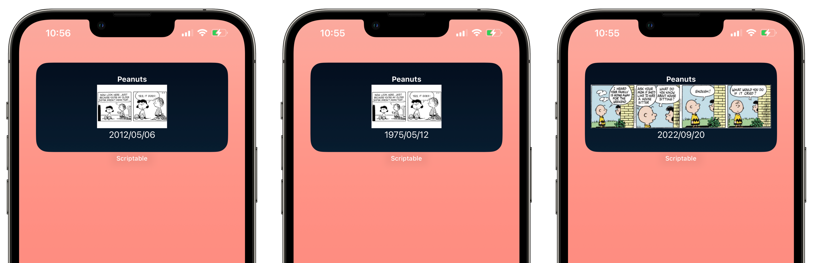
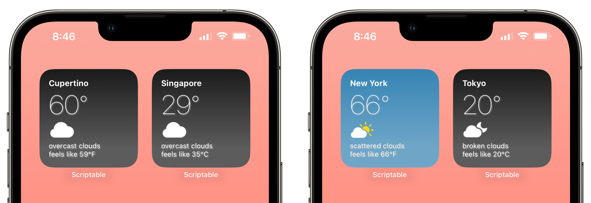

# Widgets

The _Import_ links uses [Import-Script](../Import-Script/readme.md) to import.

* [xkcd-widget](#xkcd-widget)
* [Peanuts™ Widget](#peanuts-widget)
* [Simple Weather Widget](#simple-weather-widget)
* [Transparent Widgets](#transparent-widgets)

* [RoutineHub Profile Widget](#routinehub-profile-widget)
* [Text File Widget](#text-file-widget)
* [ButtonsWidget](#buttons-widget)

**Archived / Not Working**

* [US Elections Widget](#us-elections-widget) - data source not available
* [Instagram Latest Posts](#instagram-latest-posts) - too many variations on Instgram API

---

## xkcd Widget

A widget to show current/random xkcd comic.

[Source](../source/xkcd.js) | [Import](https://open.scriptable.app/run/Import-Script?url=https://github.com/supermamon/scriptable-scripts/source/xkcd.js) | [Docs](xkcd-widget.md)

[[top]](#widgets)

--- 
### Peanuts Widget

A widget to show current/random Peanuts™ comic.

[Source](../source/peanuts-widget.js) | [Import](https://open.scriptable.app/run/Import-Script?url=https://github.com/supermamon/scriptable-scripts/source/peanuts-widget.js) | [Docs](peanuts-widget.md)

[[top]](#widgets)

---
### Simple Weather Widget

Example widget that uses the [openweathermap](openweathermap.md) module. 

[Source](../source/simple-weather-widget.js) | [Import](https://open.scriptable.app/run/Import-Script?url=https://github.com/supermamon/scriptable-scripts/source/simple-weather-widget.js) | [Docs](openweathermap.md) 

[[top]](#widgets)

---

### RoutineHub Profile Widget
A widget to show the current shortcuts and download counts of a [routinehub.co](https://routinehub.co) profile. 

[Source](routinehub-widgets/rh-profile-widget.js) | [Import](https://open.scriptable.app/run/Import-Script?url=https://github.com/supermamon/scriptable-scripts/routinehub-widgets/rh-profile-widget.js) 

[[top]](#widgets)

---

### Text File Widget

Display the contents of a text file on a widget. Works best for short texts but also flexible to allow displaying longer text files. 
This can be used as a lock screen or a home screen widget.

[Source](../source/lib-text-file-widget.js) | [Import](https://open.scriptable.app/run/Import-Script?url=https://github.com/supermamon/scriptable-scripts/source/lib-text-file-widget.js)

[[top]](#widgets)

---

### Buttons Widget

A customizable launcher widget. See the [documentation](buttons-widget.md).

* [Source](../source/buttons-widget.js) | [Import](https://open.scriptable.app/run/Import-Script?url=https://github.com/supermamon/scriptable-scripts/source/buttons-widget.js) 
* [Example Source](../source/buttons-widget-sample.js) | [Import](https://open.scriptable.app/run/Import-Script?url=https://github.com/supermamon/scriptable-scripts/source/buttons-widget-sample.js) 

[[top]](#widgets)

---

## Archived / Not Working

### US Elections Widget
Show the latest electoral votes for all candidates.

[Source](misc/us-elections.js) | [Import](https://open.scriptable.app/run/Import-Script?url=https://github.com/supermamon/scriptable-scripts/misc/us-elections.js)

[[top]](#widgets)

---
### Instagram Latest Posts
Randomly show between the 12 of the most recent post from a user or users.

[Source](https://github.com/supermamon/scriptable-instagram-widgets/blob/master/ig-latest-post.js) | [Import](https://open.scriptable.app/run/Import-Script?url=https://github.com/supermamon/scriptable-instagram-widgets/ig-latest-post.js)

[[top]](#widgets)
