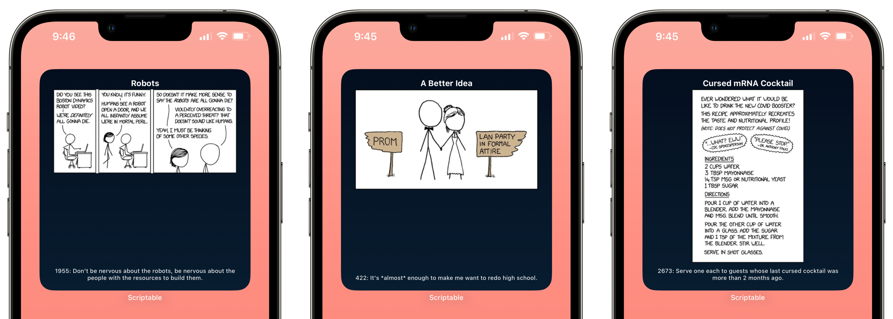

# xkcd widget
---

A widget to show current/random xkcd comic.

[Source](source/xkcd.js) | [Import](https://open.scriptable.app/run/Import-Script?url=https://github.com/supermamon/scriptable-scripts/source/xkcd.js) 

---

## Options

| Option                 | Default | Description                                                                                   |
| ---------------------- | ------- | --------------------------------------------------------------------------------------------- |
| `BACKGROUND_DARK_MODE` | system  | Set to light or dark mode. Either set to `yes`, `no` or `system` to follow the system setting |
| `RANDOM`               | false   | Set to `true` to show random comic instead of today's one.                                    | 
| `SHOW_ALT`             | true    | Show the alt text as caption                                                                  |

The `RANDOM` option can also be overriden by setting the widget parameter to `random`.
