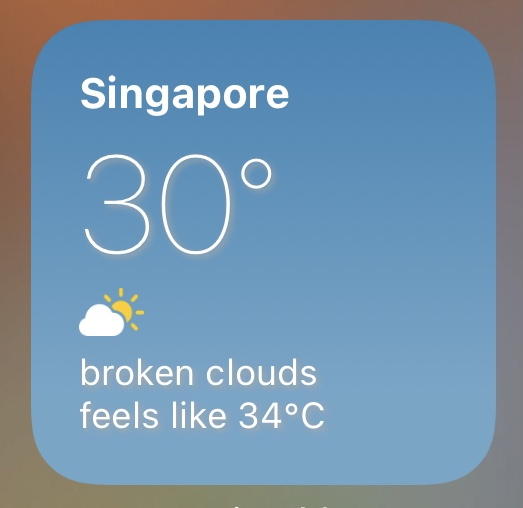

# openweathermap.js

A module to encapsulate OpenWeatherMap's [One Call API](https://openweathermap.org/api/one-call-api) and additional information shared by developers over the Automators.fm community.

## Features

* Automatic location detection or custom coordinates
* Night time detection
* SFSymbol names for weather conditions
* Units information
* OpenWeatherMap icon urls

## How to Use

Below are some example usage of the module.

**Automatic location detection**  

To identify the coordinates of the current location

```javascript
const API_KEY = 'your-api-key'
const owm = importModule('openweathermap.js')
const weatherData = await owm({appid: API_KEY})
```

**Automatic location detection & reverse geocoding**


This will also provide address information instead of just coordinates.

```javascript
const API_KEY = 'your-api-key'
const owm = importModule('openweathermap.js')
const weatherData = await owm({appid: API_KEY, revgeocode:true})
```

**Specified coordinates**

```javascript
const API_KEY = 'your-api-key'
const owm = importModule('openweathermap.js')
const weatherData = await owm({appid: API_KEY, lat: 37.32, lon: -122.03})
```

**Localization**

You can pass the pass `lang` and `units` as options to receive alternative results.
Defaults are `en` and `metric` respectively.

```javascript
const API_KEY = 'your-api-key'
const owm = importModule('openweathermap.js')
const weatherData = await owm({appid: API_KEY, lang: 'fr', units: 'metric'})
```

## Additional Information

Units returned by the API depending on the `units` parameter. Information base from the [Units of Measurement](https://openweathermap.org/api/one-call-api#data) documentation.
```javascript
.units: {
    temp 
    pressure:
    visibility
    wind_speed
    wind_gust
    rain
    snow
}
```

Any of the arguments passed when the function is called are available in the `.args` method

```javascript
.args.appid
.args.location_name
.lat
.lon
.revgeocode
.lang
.units
```

Nighttime and SFSymbol information fields for the `current` and `hourly` data

* `.is_night` - boolean to signify whether the current condition is during night time
* `.weather[0].sfsymbol` - SFSymbol name to represent the weather conditions. This is an alternative to `.weather[0].icon`.
* `.icon_url` - the [icon url](https://openweathermap.org/weather-conditions#How-to-get-icon-URL) provided by OpenWeatherMap

## Example

* [simple-weather-widget.js](simple-weather-widget.js) - a weather widget that uses this module. 

